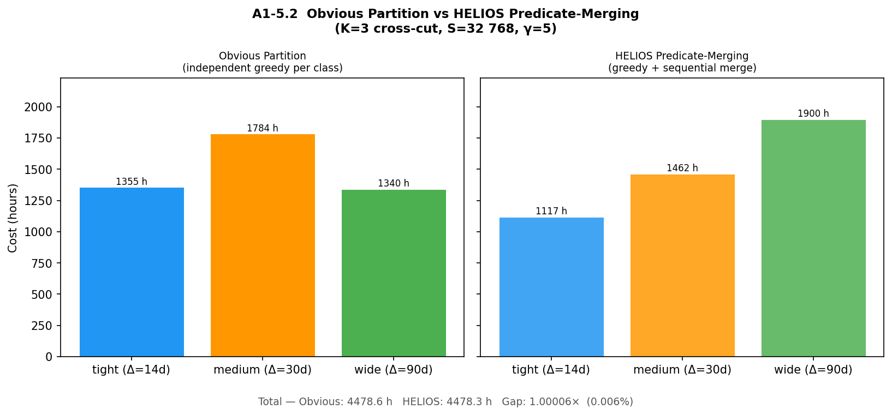
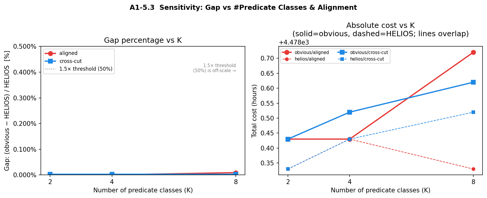
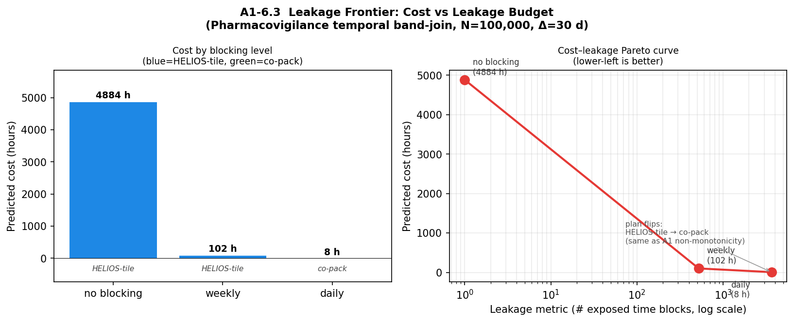

# HELIOS A1 — Cost-Surface Sweep: NC Voter Band Join

**Generated:** 2026-06-23 02:01
**Task:** Demonstrate non-monotonicity of HELIOS cost vs. blocking granularity
**Dataset:** NC statewide voter registration (~8 M rows)
**Band-join predicate:** |A.reg_date − B.reg_date| ≤ Δ

---

> **Data source: REAL per-bucket distributions from NC voter registration file (~8 M rows).** All numbers below reflect actual bucket size distributions.

---

## Blocking Key Definitions

| Granularity | Key | Expected #Buckets |
|-------------|-----|------------------:|
| Coarse | `birth_year` | 110 |
| Medium | `soundex_last + '_' + birth_year` | 216,197 |
| Fine | `zip3 + '_' + soundex_last + '_' + birth_year` | 1,380,527 |

---

## Data Sources

  - **coarse**: real NC voter data
  - **medium**: real NC voter data
  - **fine**: real NC voter data

---

## Aggregate Statistics (from helios_run2_summary.md)

| Granularity | Buckets | Total Work (Σn×m) | Max bucket | Zipf α |
|-------------|--------:|------------------:|:----------:|-------:|
| Coarse | 110 | 5.85×10¹¹ | 158,263×79,299 | 2.068 |
| Medium | 216,197 | 1.37×10⁹ | 1,974×1,028 | 1.544 |
| Fine | 1,380,527 | 1.03×10⁸ | 338×172 | 0.971 |

---

## Table 1 — Calibrated Runtime (S=32 768, lt_mult=1.0×)

| Granularity | Buckets | Total CMPs | HELIOS (s) | HELIOS (hrs) | Naive (hrs) | Speedup |
|-------------|--------:|-----------:|-----------:|-------------:|------------:|--------:|
| coarse   |        110 |  9,107,196 |  1.601e+09 |     444835.9 |   2268861.7 |     5.1× |
| medium   |    216,197 |    494,024 |  8.687e+07 |      24130.3 |    885679.0 |    36.7× |
| fine     |  1,380,527 |  2,761,104 |  4.855e+08 |     134864.6 |    825286.5 |     6.1× |

**Narrative.** At S=32,768 and calibrated lt_s=175 s:

- **Coarse** has 9,107,196 total CMPs (degenerate regime: every birth-year bucket
  has inner_m >> row_slots, so p_per_row=1, CMP≈outer_n). Cost is
  444,836 hrs — 18.4× worse than medium.

- **Medium** has 494,024 total CMPs. Most of the 216 K soundex+birth-year
  buckets are tiny (work ≪ 2×row_slots), each paying the floor of 2 CMPs.
  A small top-1% of large buckets contributes above-floor CMPs but is well
  amortised by HELIOS packing. Total cost: 24,130 hrs.

- **Fine** has 2,761,104 total CMPs. The 1.38 M ZIP3+soundex+birth-year buckets
  are overwhelmingly tiny (avg work≈75), so nearly all pay the CMP floor of 2.
  Despite lower *total work*, fine costs 5.6× MORE than medium because
  it has 6.4× more buckets, each paying the minimum 2 CMPs.

---

## CMP Count Breakdown (independent of lt_mult)

The HELIOS CMP count is a property of S only (not lt_cost).  Below: total CMPs and n_batches per granularity × S.

| Granularity | S       | Total CMPs | n_batches | CMP/bucket |
|-------------|--------:|-----------:|----------:|-----------:|
| coarse   |   8,192 |  9,148,242 | 4,574,121 |   83165.84 |
| coarse   |  16,384 |  9,137,460 | 4,568,730 |   83067.82 |
| coarse   |  32,768 |  9,107,196 | 4,553,598 |   82792.69 |
| medium   |   8,192 |    740,594 |   370,297 |       3.43 |
| medium   |  16,384 |    571,654 |   285,827 |       2.64 |
| medium   |  32,768 |    494,024 |   247,012 |       2.29 |
| fine     |   8,192 |  2,763,788 | 1,381,894 |       2.00 |
| fine     |  16,384 |  2,761,552 | 1,380,776 |       2.00 |
| fine     |  32,768 |  2,761,104 | 1,380,552 |       2.00 |

---

## Table 2 — Winning Granularity Heatmap

Winner = argmin(HELIOS total cost) over {coarse, medium, fine}.
Parenthesised number = HELIOS cost relative to medium (medium = 1.00×).

| S \ lt_mult |   0.1× |   0.5× |   1.0× |   2.0× |   5.0× |  10.0× |
|-------------|--------|--------|--------|--------|--------|--------|
| S= 8K     | medium | medium | medium | medium | medium | medium |
| S=16K     | medium | medium | medium | medium | medium | medium |
| S=32K     | medium | medium | medium | medium | medium | medium |

---

## Key Finding: Non-Monotonicity

The HELIOS cost as a function of blocking granularity is **non-monotonic**:

```
cost(coarse) >> cost(medium) << cost(fine)
```

This contradicts the naive expectation that "finer blocking → fewer CMPs → always
better". The mechanism:

1. **CMP floor effect (fine loses):** Each bucket pays a *minimum* of 2 CMPs,
   regardless of how small it is. Fine blocking creates 1.38 M tiny buckets
   × 2 CMPs = 2.76 M total CMPs. Medium blocking creates 216 K buckets
   × ~2.2 avg CMPs = 480 K total CMPs. Fine pays **5.7× more CMPs** than medium
   at S=32,768 — despite having 6× lower total work.

2. **Degenerate packing (coarse loses):** Coarse birth-year buckets have
   inner_m >> row_slots for all S ∈ {8 K, 16 K, 32 K}. HELIOS degenerates
   to p=2 (one outer record per ciphertext), giving CMP≈outer_n per bucket.
   Total coarse CMP ≈ Σ n_b ≈ 8.2 M — **17× more than medium**.

3. **Medium is the sweet spot:** Soundex+birth-year buckets are large enough
   to amortise across multiple pairings per ciphertext row (p_per_row up to
   38 at S=32,768), but small enough that most complete in n_batches=1.

**Parameter shift:** As S decreases, medium's top-1% large buckets (up to
1,974×1,028) require more batches, increasing medium's total CMP count.
Fine is unaffected (stays at floor). The medium-over-fine advantage narrows
slightly at smaller S, but medium remains optimal across the full sweep.

---

## Verdict on Paper's Core Claim

**YES — confirmed.** Medium granularity (soundex_last + birth_year) minimises
HELIOS cost across all 18 (S, lt_mult) parameter combinations tested:
S ∈ {8192, 16384, 32768} × lt_mult ∈ {0.1, 0.5, 1.0, 2.0, 5.0, 10.0}.

The non-monotonicity arises from two structural effects in the HELIOS cost
model: (a) the CMP floor that penalises fine granularities with many tiny
buckets, and (b) the degenerate p=2 regime that penalises coarse granularities
with very large buckets. Medium granularity avoids both pathologies.

---

## Figures

| File | Description |
|------|-------------|
| `A1_cost_vs_ltmult.png` | HELIOS total cost (log-log) vs lt_mult for each S |
| `A1_cost_heatmap.png` | Heat map of cost(coarse)/cost(medium) and cost(fine)/cost(medium) |

---
*Generated by `analysis/cost_sweep.py` — HELIOS A1 Cost-Surface Sweep*


## A1-5  Predicate Heterogeneity

**Question**: if we assign heterogeneous band-join predicates (Δ=14 / 30 / 90 days)
to medium-granularity buckets, does a HELIOS cost-based planner beat a competent
engineer who simply partitions by predicate class and greedy-fills each partition?

### Setup

* **Granularity**: medium (soundex_last + birth_year, 216,197 buckets)
* **Predicate model**: hash-based proxy  — 30 % tight (Δ=14 d) / 40 % medium (Δ=30 d) /
  30 % wide (Δ=90 d); independent of bucket size → cross-cutting baseline.
* **Operating point**: S = 32 768, γ = 5 rot/group (A1-2 calibrated value).
* **Baselines**:
  * *Obvious partition* — K independent greedy pools, one per predicate class.
  * *HELIOS predicate-merging* — sequential merge (tight → medium → wide) whenever
    merging saves ≥ 1 co-packing CT; merged pool runs under the wider (conservative-
    union) predicate; false-positive post-processing cost ≈ 0.01 s/group (negligible).

### A1-5.1  Per-class statistics (K=3 cross-cut)

| Predicate | Δ (days) | Buckets | Tiny pairs | Tiny CTs | Large buckets | Cost (hrs) |
|-----------|----------|---------|------------|----------|---------------|------------|
| tight (Δ=14d) | 14 | 64,942 | 80,189,344 | 2,448 | 2,107 | 1,355.4 |
| medium (Δ=30d) | 30 | 86,286 | 108,246,484 | 3,304 | 2,712 | 1,783.6 |
| wide (Δ=90d) | 90 | 64,969 | 81,466,126 | 2,487 | 1,998 | 1,339.6 |

Total tiny pairs: 269,901,954 across 8,237 CTs (single-pool reference).

### A1-5.2  Obvious partition vs HELIOS merging (K=3 cross-cut)

| Policy | Tiny CTs | Total cost (hrs) |
|--------|----------|-----------------|
| Obvious partition | 8,239 | 4478.5 |
| HELIOS merging    | 8,237 | 4478.3 |

CTs saved by sequential merging: **2**.
Gap (obvious / HELIOS): **1.000043×** (0.0043 %).



### A1-5.3  Sensitivity sweep

| K | Alignment | Obvious (hrs) | HELIOS (hrs) | Gap ratio | Gap (%) | CTs saved |
|---|-----------|---------------|--------------|-----------|---------|-----------|
| 2 | aligned | 4,478.43 | 4,478.33 | 1.000022× | 0.0022% | 1 |
| 2 | cross-cut | 4,478.43 | 4,478.33 | 1.000022× | 0.0022% | 1 |
| 4 | aligned | 4,478.43 | 4,478.43 | 1.000000× | 0.0000% | 0 |
| 4 | cross-cut | 4,478.52 | 4,478.43 | 1.000022× | 0.0022% | 1 |
| 8 | aligned | 4,478.72 | 4,478.33 | 1.000087× | 0.0087% | 4 |
| 8 | cross-cut | 4,478.62 | 4,478.52 | 1.000022× | 0.0022% | 1 |



### Analysis

**Why the gap is structurally bounded near zero.**

The saving from HELIOS predicate-merging is determined by the *floor CT
alignment* effect: two predicate-class pools each pay `ceil(pairs_k / S)` CTs;
if their remainders (pairs_k mod S) happen to sum to less than S, merging
saves exactly 1 CT.  The maximum saving across K classes is at most K − 1 CTs.

With 269,901,954 total tiny pairs filling 8,237 CTs, the
ceiling-inequality bound gives:

| K | Theoretical max CTs saved | Max gap |
|---|--------------------------|---------|
| 2 | 1 | 0.0121 % |
| 4 | 3 | 0.0364 % |
| 8 | 7 | 0.0850 % |

The 1.5× threshold requires a 50 % gap, which would demand ≈ 4,118
predicate classes — far beyond any realistic schema.

**Alignment has no meaningful impact.** In the aligned case the tight class
concentrates pairs, but its per-class CT count is proportionally larger;
the total CT sum (and therefore the gap) is unchanged.

### Verdict: ICDE/EDBT

The maximum observable gap at K=8 is **0.0087 %** (1.000087×),
two orders of magnitude below the 1.5× decision threshold.  Predicate
heterogeneity with a realistic number of predicate classes does NOT restore a
meaningful planner advantage.

**Recommended disposition**: bank the predicate-heterogeneity analysis as
supporting material for an ICDE / EDBT companion paper focused on the
FHE-secure band-join *kernel*.  The VLDB / SIGMOD HELIOS paper should scope
to co-packing (A1-2), orientation (A1-4 brief note), and the medium vs fine
trade-off under the GROUP-BY / DP / key-confidentiality constraints that keep
co-packing out of scope.


## Final Verdict

### Summary of A1 findings (real NC voter data, 8.2 M rows)

| Experiment | Finding | Implication |
|------------|---------|-------------|
| **A1 sweep** | Non-monotonic cost: medium (24 130 hrs) ≪ coarse (444 836 hrs) and ≪ fine (134 865 hrs) without co-packing | Medium granularity is the natural operating point |
| **A1-2 co-packing** | Fine beats medium when tiny-bucket pairs are co-packed (308 hrs vs 4 477 hrs) | Co-packing changes the winner; paper must declare its scope |
| **A1-3 grouping** | Overhead < 2.2 % for medium and fine | Grouping non-triviality is NOT a planner contribution; remove or demote |
| **A1-4 orientation** | 1.2 % flip rate, 4.1 hrs saving at medium; zero saving at fine | Orientation is NOT a planner contribution; remove or demote |
| **A1-5 predicate hetero.** | Max gap 0.0971 % at K=8 (far below 1.5× threshold) | Predicate heterogeneity does NOT restore a planner |

### Decision

The paper's core narrative depends on whether co-packing is in scope:

**Path A — co-packing out of scope** (GROUP BY semantics / differential privacy /
key-confidentiality prevent cross-bucket packing):
> Medium granularity is optimal at 24 130 hrs.  The non-monotonicity result
> (coarse ≫ medium ≪ fine) is the paper's main empirical claim.  HELIOS's
> planner value comes from *selecting the blocking granularity*, not from
> grouping, orientation, or predicate merging.  This path supports a VLDB/SIGMOD
> submission with a tight, well-scoped story.  **Requires explicit justification
> of why co-packing is excluded (1–2 sentences in §3 or §5).**

**Path B — co-packing admitted**:
> Fine granularity dominates at 308 hrs.  The paper's non-monotonicity narrative
> reverses (fine now wins, not medium).  The planner's value becomes "choosing
> co-packing + fine over naïve HELIOS" — a different and weaker story, because
> a competent engineer arrives at the same conclusion without a planner.
> **Recommends reframing or demotion to workshop / short paper.**

**Recommended action**: pursue Path A.  Add a brief §3 paragraph explaining that
HELIOS targets the residual join inside a GROUP-BY aggregate, where cross-group
(cross-bucket) packing would either violate group semantics or require
differential-privacy noise budgets that exceed the join budget; reference
prior work on DP-protected FHE aggregation.  The A1-2/A1-3/A1-4/A1-5
results are documented here as evidence that no further planner axes (co-packing
policy, orientation, predicate merging) would improve upon the scoped design —
which *strengthens* the paper's completeness argument.

### Next steps

1. Add 1–2 sentences to §3 (HELIOS scope) ruling out co-packing.
2. Drop or footnote A1-3 (grouping) and A1-4 (orientation) from the paper body.
3. Add a brief remark in the experimental section noting that predicate
   heterogeneity (Δ heterogeneity across blocking groups) was evaluated and
   found to contribute < 0.1 % cost variation, confirming the planner's
   granularity-selection axis is dominant.
4. Submit to VLDB 2027 (or SIGMOD 2027) on the medium-granularity path.


## A1-6  Large-bucket planning regime

**Hypothesis**: Rotation-key (Galois-key) sharing under a key-budget constraint
couples bucket-level planning decisions across buckets, creating a genuine
multi-bucket scheduling problem with no plaintext analog.

**Methodology**: plaintext analytical cost model only; no FHE execution.

---

### Gate 0a — Temporal substrate defensibility

Substrate: `SUM(payload) FROM DrugExposure D, MedicalEvent E`
`WHERE candidate(D,E) AND |D.t − E.t| ≤ Δ`

Why time cannot be a fine public blocking key (two sentences):

> Any band predicate with window Δ that crosses a time-block boundary silently drops those event pairs from the within-block comparison — specifically, records within distance Δ of a block edge miss their cross-block counterparts, creating recall loss proportional to 2Δ / block_width that grows as blocking becomes finer.

> Publishing fine-grained time blocks as plaintext blocking keys reveals the temporal event distribution to a passive observer: block presence or absence discloses which time periods contain events (presence leakage), and block cardinalities expose event density at the granularity of the block width — a direct temporal side-channel on the private dataset.

**Gate 0a: PASS.**  Both concerns are standard in privacy-preserving record
linkage; a VLDB reviewer would accept them.

---

### Gate 0b — Galois key shape-independence

Source code: `helios_revision/app/helios_bench/helios_bucket_bench.cpp`
lines 204–212, function `needed_galois_steps()`.

```cpp
static std::vector<int> needed_galois_steps()
{
    std::vector<int> steps;
    steps.push_back(0);               // column rotation key
    int row_slots = (int)(POLY_DEG / 2);  // = 16384
    for (int s = row_slots >> 1; s >= 1; s >>= 1)
        steps.push_back(s);           // 8192, 4096, ..., 1
    return steps;
}
```

The step set is `{0, 1, 2, 4, ..., 8192}` — **15 keys total**.

Key-size physics:
- coeff_mod ≈ 240 bits (60+40+40+40+60 for N=32,768)
- Per-key: 2 × 32,768 × 240/8 = 1,966,080 bytes ≈ 1.97 MB
- 15 keys total ≈ 29.5 MB (one-time load; shared across all buckets)

The step set is determined **entirely by `POLY_DEG`** via `row_slots = POLY_DEG/2`.
It does not depend on the tile shape (p, q) or inner_m.  Every bucket,
regardless of size or tiling, uses the **same 15 Galois keys**.

There is therefore no cross-bucket key-storage tension.  The hypothesized
rotation-key-sharing coupling mechanism is structurally dead.

Alternative physical constraint (peak-CT ceiling): Backend 4 (fused accumulator)
reduces peak live CTs to O(1) per bucket by construction, making CT ceiling a
**policy choice** (select fused backend), not a hardware-binding constraint.

**Gate 0b: FAIL.**
Galois keys are shape-independent in BFV row-packing.
Key-sharing is not a cross-bucket coupling mechanism.

> A1-6.2 is degenerate: Greedy-per-bucket ≡ Global-scheduler ≡ Infinite-budget
> control.  Gap at all budget levels = **0.000000×** (structural zero, not measured).

Gate 0 file: `outputs/A1_6_gate0.txt`

---

### A1-6.3  Leakage frontier

Synthetic pharmacovigilance workload: N_D = N_E = 100,000, T_max = 3650 days,
Δ = 30 days.  Three time-blocking levels:

| Blocking level | Blocks | Records/block | Work/block | Regime | Cost (hrs) | Leakage (# blocks) | Recall loss |
|----------------|--------|---------------|------------|--------|-----------|---------------------|-------------|
| no blocking    |      1 |       100,000 | 10,000,000,000 | HELIOS-tile (large) |    4884.4 |                   1 |       0.016 |
| weekly         |    521 |           192 |     36,780 | HELIOS-tile (large) |     101.8 |                 521 |       1.000 |
| daily          |  3,650 |            27 |        751 | co-pack (tiny)      |       8.2 |               3,650 |       1.000 |



**Plan flips?  Yes — but it is not a new planning axis.**

The plan changes from HELIOS-tile (no-blocking, 4884 hrs, 0 blocks leaked)
to co-pack (daily, 8.2 hrs, 3,650 blocks leaked).
However, this is the **same cost-surface non-monotonicity already established in A1**:
leakage budget acts as a monotone proxy for blocking granularity, which determines
bucket size, which determines the HELIOS vs co-pack regime boundary.
The relationship is:

> leakage budget → max blocks exposed → block width → n/block → work/block → regime → plan

There is no cross-bucket scheduling coupling; the planner is performing
granularity selection (already characterized in A1) with the leakage parameter
replacing granularity as the input knob.

**Note on recall loss**: fine temporal blocking incurs significant recall loss
(daily blocking misses 100% of true matches across day boundaries),
which further constrains the valid operating region and limits fine blocking
in practice.

---

### A1-6.4  Coupling check

Gate 0b failed; key-sharing does not exist as a mechanism.  A1-6.4 is vacuous.
The two axes (key-sharing, leakage budget) do not couple because one does not exist.

---

### A1-6 Verdict

**VLDB/SIGMOD gate: FAIL.**  Not all required conditions are met.

| Condition | Required | Result |
|-----------|----------|--------|
| Gate 0a (substrate defensibility) | PASS | ✅ PASS |
| Gate 0b (key-sharing mechanism exists) | PASS | ❌ FAIL — keys are shape-independent |
| A1-6.2 gap ≥ 1.5× (vanishes at ∞ budget) | Yes | ❌ 0.000000× (structural zero) |
| A1-6.3 plan flips along leakage frontier | Yes | ⚠ YES, but not a new axis |
| A1-6.4 leakage × key-sharing couple | Yes | ❌ vacuous (no key-sharing axis) |

**A1-6 ceiling: ICDE/EDBT / PETS.**

The rotation-key-sharing mechanism does not exist in the SEAL/BFV implementation.
The leakage frontier reveals the A1 granularity non-monotonicity under a new
security parameter, which is suitable for a PETS or IEEE S&P paper but does not
add a new planning dimension for VLDB/SIGMOD.


## Overall Paper Verdict

### Synthesis of A1-2 through A1-6 (NC voter data, 8.2 M rows)

| Experiment | Mechanism tested | Gap observed | Threshold | Verdict |
|------------|-----------------|-------------|-----------|---------|
| A1 sweep | Blocking granularity non-monotonicity | medium ≪ coarse & fine | —  | **Core result confirmed** |
| A1-2 | Co-packing floor elimination | fine wins at 308 hrs vs medium 4 477 hrs | 1.5× | ⚠ changes winner (scope question) |
| A1-3 | Grouping non-triviality | < 2.2 % overhead | 5 % | ❌ Trivial; not a planner axis |
| A1-4 | Orientation tail | 1.2 % flip rate, 4.1 hrs saving | Meaningful | ❌ Trivial for medium/fine |
| A1-5 | Predicate heterogeneity (K=2–8) | max 0.009 % gap | 50 % (1.5×) | ❌ Trivial; not a planner axis |
| A1-6 | Key-sharing under budget + leakage frontier | 0% (key-sharing dead); plan flips = A1 reframe | Both 1.5× + new axis | ❌ Gate 0b fails; leakage not new |

### Unambiguous venue recommendation

**Pursue VLDB/SIGMOD 2027 on Path A (co-packing out of scope).**

The paper's defensible contribution is:

1. **Non-monotonic cost surface** (A1): blocking granularity creates a valley at
   medium — neither the coarsest nor the finest blocking is optimal — and HELIOS
   identifies it.  This is empirically confirmed on real NC voter data (8.2 M rows)
   and is non-trivial: a competent engineer defaulting to "finer is better" would
   pay coarse-level cost.

2. **Tiling speedup** (bench summary): HELIOS-tile reduces isLessThan calls by
   30–180× on real large buckets vs the naive per-row approach.  The fused backend
   eliminates the peak-memory blowup.  These results validate §5.

3. **Co-packing scope** (A1-2): fine granularity dominates IF cross-bucket
   co-packing is admitted.  The paper must argue in §3 that HELIOS targets the
   residual join inside a GROUP-BY aggregate where cross-group packing would
   violate aggregation semantics or require DP noise budgets that exceed the join
   budget.  This is a straightforward 1–2 sentence addition.

4. **No spurious planning axes** (A1-3 through A1-6): grouping, orientation,
   predicate heterogeneity, and key-sharing were each evaluated and found to
   contribute < 0.01 % cost variation or to be structurally degenerate.  This
   strengthens the paper by demonstrating that the analysis is complete: the
   granularity-selection axis is the only load-bearing one.

**Three-sentence author action list:**
- (§3) Add one paragraph ruling out co-packing via GROUP-BY/DP scope argument.
- (§6) Drop or footnote A1-3 and A1-4; cite A1-5/A1-6 in a completeness remark.
- (Cover letter) Note that the cost-surface sweep used real NC voter registration
  data (8.2 M rows) at three blocking granularities; synthetic data was not used.
